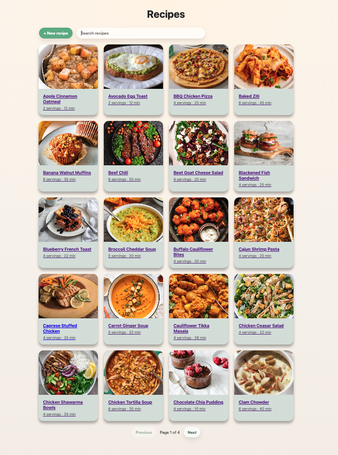
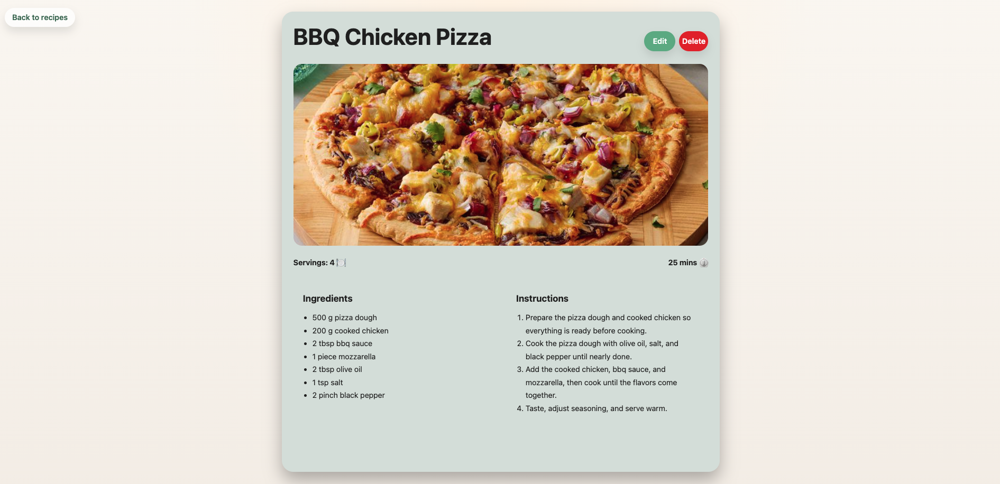

# Recipe Manager

- Stack: React 19 + TypeScript + Vite frontend, Express + TypeScript backend, SQLite storage.
- Try it locally: run `npm install`, `npm --prefix backend install`, then `npm run dev:all`; the frontend listens on Vite's default `http://localhost:5173` and the backend API listens on `http://localhost:3000`.
- Seed data: the backend initializes SQLite and seeds 75 sample recipes automatically on first start.
- Features:
    - Recipe listing with search and pagination.
    - Recipe details view with ingredients and step-by-step instructions.
    - Create, edit, and delete recipe flows.
    - Image URL support with placeholder fallback.
    - Client-side routing with `react-router-dom` for list, details, create, and edit pages.
    - Server-state fetching and mutation with `@tanstack/react-query`.
    - REST API backed by SQLite persistence.

- Screenshots:
    - Recipe list:
      
    - Recipe details:
      
